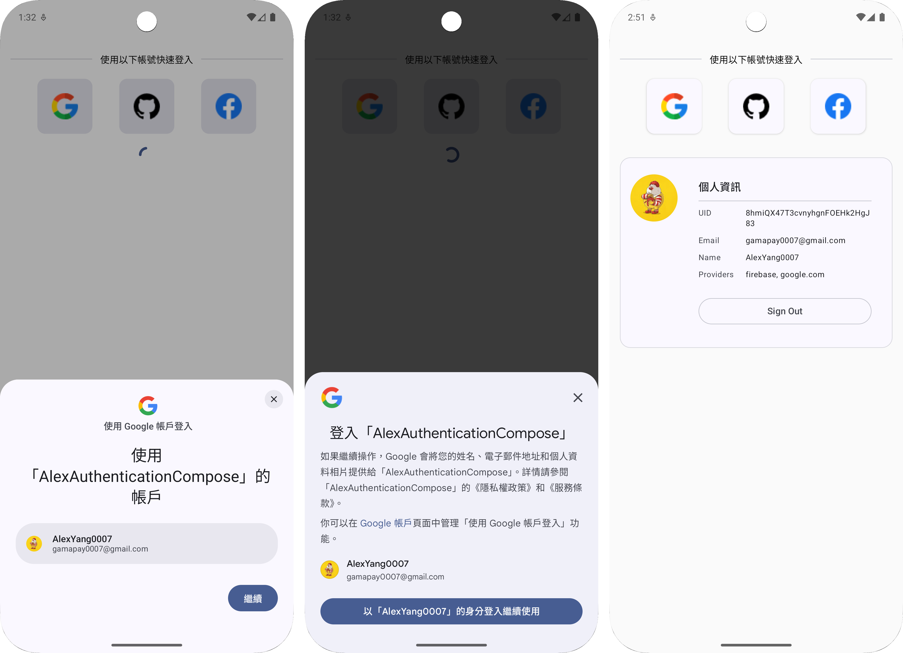
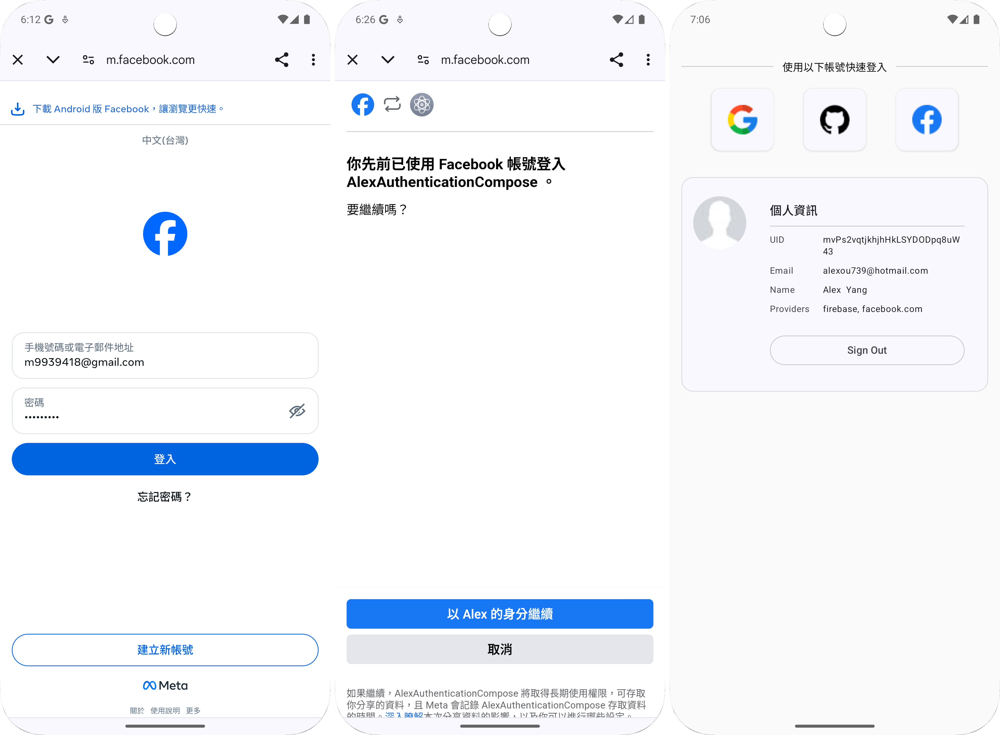
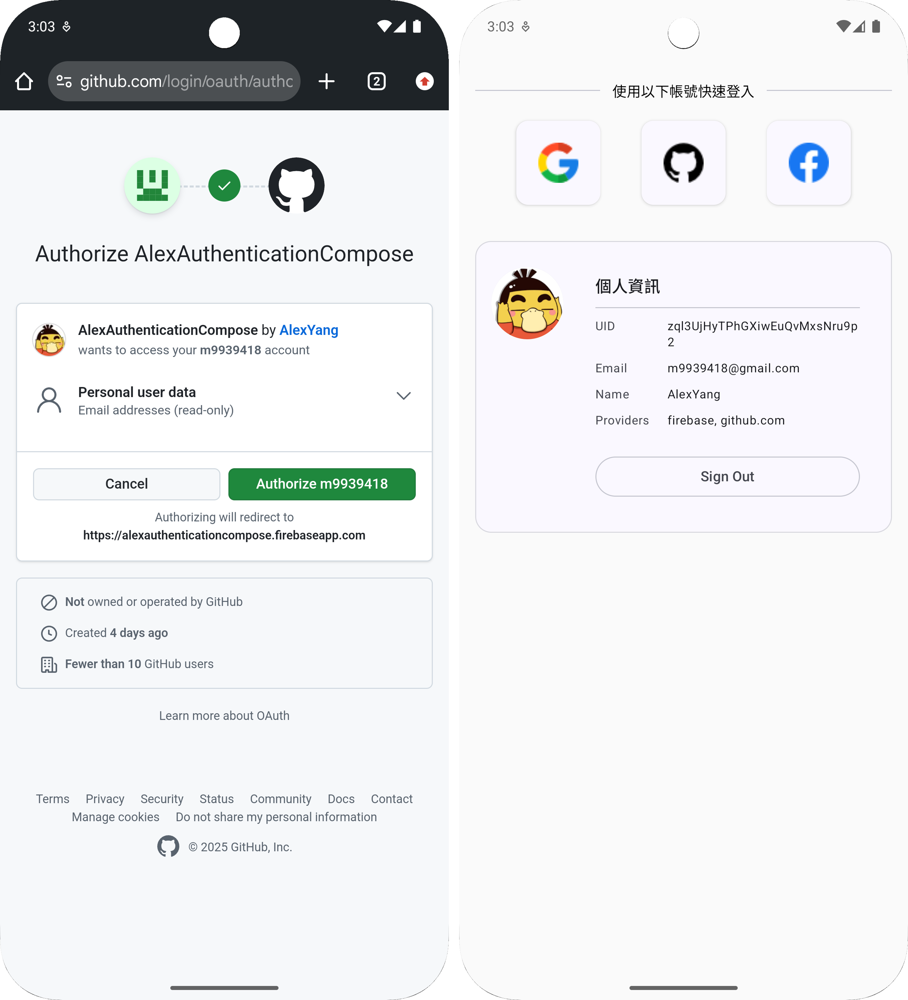

# Alex Authentication Compose

🔐 **Android Multi-Provider Authentication with Firebase & Jetpack Compose**

AuthenticationCompose 是一個以 **Firebase Authentication + Multiple OAuth Providers** 為核心的認證示範專案，完整展示 **Google、Facebook、GitHub 多平台登入** 的工程級實作方式。

展示如何在 Android App 中整合：

- **Google Sign-In (Credential Manager API)**
- **Facebook Login (Facebook SDK)**
- **GitHub OAuth (Firebase OAuth Provider)**
- **Firebase Authentication 統一管理**
- **Jetpack Compose UI**
- **Clean Architecture (Domain / Data / Presentation)**
- **Hilt Dependency Injection**

---

## Demo

| Provider | Screenshot                            |
| -------- |---------------------------------------|
| **Google** |  |
| **Facebook** |    |
| **GitHub** |  |

---

## ✨ 專案特色

- ✔ Firebase Authentication 完整整合
- ✔ 多平台 OAuth 登入支援 (Google / Facebook / GitHub)
- ✔ Credential Manager API (Google 最新登入方案)
- ✔ Clean Architecture + MVVM Pattern
- ✔ Hilt Dependency Injection
- ✔ Jetpack Compose UI (支援深色模式)
- ✔ Kotlin Coroutines + Flow
- ✔ 模組化、可擴充、可測試

---

## 🏗 Architecture Overview

```text
com.alex.yang.authenticationcompose
│
├── core
│   └── utils
│       └── StringExtension.kt                    // 工具函數 (頭像縮寫)
│
├── feature.auth
│   ├── data
│   │   ├── firebase
│   │   │   └── FirebaseAuthDataSource.kt        // Firebase Auth 數據源
│   │   │
│   │   ├── mapper
│   │   │   └── AuthUserMapper.kt                // FirebaseUser → AuthUser 轉換
│   │   │
│   │   ├── provider
│   │   │   ├── GoogleIdTokenClient.kt           // Google 登入客戶端
│   │   │   ├── FacebookTokenClient.kt           // Facebook 登入客戶端
│   │   │   └── FirebaseOAuthSignInClient.kt     // Firebase OAuth 客戶端
│   │   │
│   │   └── repository
│   │       ├── AuthRepositoryImpl.kt            // 認證倉儲實作
│   │       └── OAuthRepositoryImpl.kt           // OAuth 倉儲實作
│   │
│   ├── domain
│   │   ├── model
│   │   │   └── AuthUser.kt                      // 認證用戶領域模型
│   │   │
│   │   ├── repository
│   │   │   ├── AuthRepository.kt                // 認證倉儲介面
│   │   │   └── OAuthRepository.kt               // OAuth 倉儲介面
│   │   │
│   │   └── usecase
│   │       ├── ObserveAuthStateUseCase.kt       // 觀察認證狀態用例
│   │       ├── SignInUseCase.kt                 // 登入用例
│   │       └── SignOutUseCase.kt                // 登出用例
│   │
│   └── presentation
│       ├── component
│       │   ├── Avatar.kt                        // 頭像元件
│       │   ├── InfoRow.kt                       // 資訊列元件
│       │   ├── SectionHeader.kt                 // 區段標題元件
│       │   ├── SocialIconButton.kt              // 社交登入按鈕
│       │   └── UserInfoCard.kt                  // 用戶資訊卡片
│       │
│       ├── di
│       │   ├── AuthModule.kt                    // Singleton 依賴注入
│       │   └── AuthActivityModule.kt            // Activity 依賴注入
│       │
│       ├── AuthScreen.kt                        // 認證主畫面
│       └── AuthViewModel.kt                     // 認證 ViewModel
│
├── ui.theme
│   ├── Color.kt                                 // 顏色定義
│   ├── Theme.kt                                 // Material 3 主題
│   └── Type.kt                                  // 字體樣式
│
├── App.kt                                       // Application 類別
└── MainActivity.kt                              // 主要 Activity

```

---

## 🔐 核心流程說明

### 1. Google 登入 (Credential Manager API)

**流程步驟：**

1. `GoogleIdTokenClient.getIdToken()`
    - 使用 **Credential Manager API** (Android 最新登入方案)
    - 取得 Google ID Token
2. `AuthRepository.signInWithGoogleIdToken()`
    - 建立 `GoogleAuthProvider.getCredential()`
    - 透過 Firebase 完成認證
3. `FirebaseAuthDataSource.signInWithCredential()`
    - 執行 Firebase Authentication
4. 認證成功後，`observeAuthState()` 自動更新用戶狀態

**特色：**
- ✔ 無需手動整合 Google Sign-In SDK
- ✔ 支援一鍵登入體驗
- ✔ 自動處理帳號選擇器

### 2. Facebook 登入 (Facebook SDK)

**流程步驟：**

1. `FacebookTokenClient.startLoginSuspend()`
    - 使用 **Facebook SDK LoginManager**
    - 以 Kotlin Coroutines 封裝 Callback
2. 取得 Facebook Access Token
3. `AuthRepository.signInWithFacebookAccessToken()`
    - 建立 `FacebookAuthProvider.getCredential()`
    - 透過 Firebase 完成認證
4. `CallbackManager` 處理 Activity Result

**特色：**
- ✔ Suspend 函數封裝，簡化非同步處理
- ✔ 自動處理取消和錯誤
- ✔ 完整的生命週期管理

### 3. GitHub / Apple 登入 (Firebase OAuth Provider)

**流程步驟：**

1. `OAuthRepository.signInWithGitHub()` / `signInWithApple()`
2. `FirebaseAuth.startActivityForSignInWithProvider()`
    - 使用 **Firebase OAuth Provider**
    - 啟動系統瀏覽器進行 OAuth 流程
3. 用戶授權後自動返回 App
4. Firebase 完成認證並返回 `AuthResult`

**特色：**
- ✔ 無需額外整合第三方 SDK
- ✔ Firebase 統一管理認證流程
- ✔ 支援自訂 Scopes

### 4. 登出流程

**清理項目：**

- 登出 Firebase Session (`FirebaseAuth.signOut()`)
- 清除 Google Credential (`CredentialManager.clearCredentialState()`)
- 登出 Facebook Session (`LoginManager.logOut()`)
- 確保所有 Provider 狀態清空

### 5. 認證狀態觀察

**響應式狀態管理：**

```kotlin
FirebaseAuth.AuthStateListener
    → Flow<FirebaseUser?>
    → Flow<AuthUser?>
    → StateFlow (UI)
```

- ✔ 使用 `callbackFlow` 包裝 Firebase Listener
- ✔ 自動同步認證狀態到 UI
- ✔ 生命週期安全

---

## 📦 Dependencies

### Firebase & Authentication

```kotlin
// Firebase BOM
implementation(platform("com.google.firebase:firebase-bom:34.7.0"))
implementation("com.google.firebase:firebase-auth-ktx")

// Google Credential Manager
implementation("androidx.credentials:credentials:1.5.0")
implementation("androidx.credentials:credentials-play-services-auth:1.5.0")
implementation("com.google.android.libraries.identity.googleid:googleid:1.1.1")

// Facebook SDK
implementation("com.facebook.android:facebook-login:18.1.3")
```

---

## 🎨 UI Components

### 1. SocialIconButton

社交平台登入按鈕，支援：
- Material 3 Design
- 啟用/停用狀態
- 可自訂圖標
- 卡片陰影效果

```kotlin
SocialIconButton(
    painter = painterResource(R.drawable.ic_google),
    enabled = !state.loading,
    onClick = onGoogleLoginInClick
)
```

### 2. UserInfoCard

用戶資訊卡片，顯示：
- 用戶頭像 (支援圖片 / 首字母縮寫)
- UID、Email、顯示名稱
- 登入 Provider 列表
- 登出按鈕

### 3. Avatar

智能頭像組件：
- 優先顯示用戶照片 (使用 Coil 載入)
- 無照片時顯示首字母縮寫
- 自動處理中英文名稱
- Material 3 配色

**縮寫邏輯：**
```kotlin
"Alex Yang" → "AY"
"張小明" → "張小"
"John" → "J"
```

---

## 🛡 安全性考量

### 1. Token 管理

- ✔ ID Token 與 Access Token 不存儲在 SharedPreferences
- ✔ 使用 Firebase 內建的 Session 管理
- ✔ 登出時確實清除所有 Provider Credential

### 2. OAuth Flow

- ✔ 使用系統瀏覽器進行 OAuth (避免 WebView 安全風險)
- ✔ Firebase OAuth Provider 自動處理 PKCE
- ✔ 支援 Deep Link 安全返回

---

## 🔧 設定指南

### 1. Firebase 專案設定

1. 前往 [Firebase Console](https://console.firebase.google.com/)
2. 建立新專案或使用現有專案
3. 新增 Android App
4. 下載 `google-services.json` 放置於 `app/` 目錄
5. 啟用 Authentication 功能

### 2. Google 登入設定

1. 在 Firebase Console 啟用 Google 登入
2. 取得 Web Client ID (OAuth 2.0 用戶端)
3. 在 `local.properties` 加入：
   ```properties
   GOOGLE_WEB_CLIENT_ID=YOUR_WEB_CLIENT_ID
   ```
4. 在 `build.gradle.kts` 中讀取：
   ```kotlin
   buildConfigField("String", "GOOGLE_WEB_CLINENT_ID", "\"${properties["GOOGLE_WEB_CLIENT_ID"]}\"")
   ```

### 3. Facebook 登入設定

1. 前往 [Facebook Developers](https://developers.facebook.com/)
2. 建立應用程式
3. 取得 App ID 和 Client Token
4. 在 `AndroidManifest.xml` 加入：
   ```xml
   <meta-data
       android:name="com.facebook.sdk.ApplicationId"
       android:value="@string/facebook_app_id" />
   <meta-data
       android:name="com.facebook.sdk.ClientToken"
       android:value="@string/facebook_client_token" />
   ```
5. 在 Firebase Console 啟用 Facebook 登入並配置

### 4. GitHub 登入設定

1. 前往 [GitHub Developer Settings](https://github.com/settings/developers)
2. 建立 OAuth App
3. 設定 Authorization callback URL：
   ```
   https://YOUR_PROJECT_ID.firebaseapp.com/__/auth/handler
   ```
4. 在 Firebase Console 啟用 GitHub 登入
5. 輸入 Client ID 和 Client Secret

---

## 📱 支援的登入方式

| Provider | SDK / API | 特色 |
|----------|-----------|------|
| **Google** | Credential Manager API | 一鍵登入、系統整合 |
| **Facebook** | Facebook SDK | 完整功能、好友存取 |
| **GitHub** | Firebase OAuth Provider | 開發者友善 |


---

## 🚀 未來擴充方向

- [ ] 支援 Line、Twitter 等更多 OAuth Provider
- [ ] Email/Password 登入
- [ ] 手機號碼驗證登入
- [ ] Multi-Factor Authentication (MFA)
- [ ] Biometric Authentication
- [ ] Account Linking (連結多個 Provider)
- [ ] Anonymous Sign-In 轉正式帳號
- [ ] 完整的 UI/Unit Test Coverage

---

## 📚 參考資源

- [Firebase Authentication Docs](https://firebase.google.com/docs/auth)
- [Credential Manager API](https://developer.android.com/training/sign-in/credential-manager)
- [Facebook Login for Android](https://developers.facebook.com/docs/facebook-login/android)
- [Firebase OAuth Provider](https://firebase.google.com/docs/auth/android/oauth)

---

## 👨‍💻 Clean Architecture 實踐

### Presentation Layer
- **職責**：UI 邏輯、狀態管理、用戶互動
- **技術**：Jetpack Compose、ViewModel、StateFlow

### Domain Layer
- **職責**：業務邏輯、用例定義、領域模型
- **技術**：Pure Kotlin、UseCase Pattern

### Data Layer
- **職責**：數據存取、API 整合、外部服務
- **技術**：Repository Pattern、Data Source、Mapper

**依賴方向**：Presentation → Domain ← Data

---

## 🎯 關鍵設計模式

1. **Repository Pattern** - 抽象化數據來源
2. **UseCase Pattern** - 封裝業務邏輯
3. **MVVM Pattern** - 分離 UI 與業務邏輯
4. **Dependency Injection** - 解耦合與可測試性
5. **Mapper Pattern** - 分離領域模型與數據模型
6. **Observer Pattern** - 響應式狀態管理 (Flow)

---

## Author

**Alex Yang**  
Android Engineer  
🌐 [github.com/m9939418](https://github.com/m9939418)

---

## ⭐ 如果這個專案對你有幫助，請給個 Star！

**Happy Coding! 🚀**